# VulnerableNotes

This project was done as a submission to Cyber Security Base 2025 Project 1


## Educational Purpose Disclaimer

This project is created for educational purposes to:
- Understand common web security vulnerabilities
- Learn secure coding practices especially with FastAPI and Python
- Practice identifying and fixing security flaws
- Study the OWASP Top 10

**⚠️ WARNING**

**This application contains intentional security vulnerabilities for educational purposes only.**
- **DO NOT store real sensitive data**
- **For learning and demonstration purposes only!!!**
---

## Prerequisites for running the app

- Python 3.8 or higher
- pip (Python package manager)
- Git (This is optional, for cloning the repo.)

---

## Technologies Used

- **FastAPI**
- **SQLite**
- **Jinja2** 
- **aiosqlite** 

---

## Running the app

### Linux(Ubuntu/Debian) 


1. Install Python and pip(if not already installed)
```bash
sudo apt install python3 python3-pip python3-venv
```
2. Clone or download the repository and cd into the root directory
```bash
git clone https://github.com/tvaananen02/VulnerableNotes.git
cd VulnerableNotes
```
3. Create the virtual environment:
```bash
python3 -m venv venv
```
4. Activate the virtual environment
```bash
source venv/bin/activate
```
5. Install the required dependencies:
```bash
pip install -r requirements.txt
```
6. Run the application
```bash
uvicorn app.main:app --reload
```

7. Open browser at address http://localhost:8000 to view the app

8. Use this command to erase the database from the directory root (needed to implement fixes 2 and 3 atleast)
```bash
rm vulnerablenotes.db
```
9. How to access the database
```bash
sqlite3 vulnerablenotes.db
```
### macOs
1. **Install Python (if not already installed):**

Using Homebrew:
```bash
brew install python3
```

Or download from: https://www.python.org/downloads/

2. **Clone or download the repository:**
```bash
git clone https://github.com/tvaananen02/VulnerableNotes.git
cd VulnerableNotes
```

3. **Create virtual environment:**
```bash
python3 -m venv venv
```

4. **Activate virtual environment:**
```bash
source venv/bin/activate
```

5. **Install dependencies:**
```bash
pip install -r requirements.txt
```

6. **Run the application:**
```bash
uvicorn app.main:app --reload
```

7. **Open browser:**
```
http://localhost:8000
```

### Windows

1. **Install Python:**
- Download from https://www.python.org/downloads/
- **Important:** Check "Add Python to PATH" during installation

2. **Verify installation:**
```cmd
python --version
```

3. **Clone or download the repository:**
```cmd
git clone https://github.com/tvaananen02/VulnerableNotes.git
cd VulnerableNotes
```

Or download ZIP and extract.

4. **Create virtual environment:**
```cmd
python -m venv venv
```

5. **Activate virtual environment:**

Command Prompt:
```cmd
venv\Scripts\activate.bat
```

PowerShell:
```powershell
venv\Scripts\Activate.ps1
```

If PowerShell gives an error:
```powershell
Set-ExecutionPolicy -ExecutionPolicy RemoteSigned -Scope CurrentUser
```

6. **Install dependencies:**
```cmd
pip install -r requirements.txt
```

7. **Run the application:**
```cmd
python -m uvicorn app.main:app --reload
```

8. **Open browser:**
```
http://localhost:8000
```

## Stopping the app

Simply, press CTRL+C in the terminal where the app is running

## Troubleshooting

### Port already in use
Simply use a different port e.g.

```bash
uvicorn app.main:app --reload --port 8001
```

### Database Issues
Stop the app if it is running and then run 
```bash
rm vulnerablenotes.db
uvicorn app.main:app --reload
```

### Import Errors
Try reinstalling the dependencies
```bash
pip install -r requirements.txt
```
### Virtual Environment Not Activated
```bash
# Linux/macOS
source venv/bin/activate

# Windows
venv\Scripts\activate
```

## Features
- User registration and authentication
- Create, view, and delete notes
- File attachments for notes
- Private/public note visibility (this is for demoing the exploits only)
- Test users pre-loaded with demo data
### Test users
The application comes with three pre-configured test accounts:

| Username | Password | Role |
|----------|----------|------|
| John | mypasswd123 | Regular User |
| Jane | 123dwssap | Regular User |
| admin | admin#234 | Admin User |

You can try to login as any of them and view the content.

⚠️ **Important: Test Data Maintenance**

When you delete a note from the test users, the associated file is **permanently removed** from `app/static/uploads/`. 

**To restore demo files:**
1. Note the filename before deletion
2. Delete the database: `rm vulnerablenotes.db`
3. Recreate the demo file in `app/static/uploads/`(add any content you want to demo)
4. Restart the server to reinitialize test data
---
## Security Flaws Implemented

This application intentionally contains the following OWASP Top 10 vulnerabilities (https://owasp.org/Top10/2025/):

1. **A07 - Authentication Failures** (Weak Password Requirements)

    **Explointing the fault**
    1. Go to the registration page
    2. Register a user with a password ```'a'```
    3. **Result:** Account created successfully

    **Fix**: Uncomment the password validation at lines 26-34 in [auth.py](app/routers/auth.py#L26)

    **Screenshots**

    Before:

    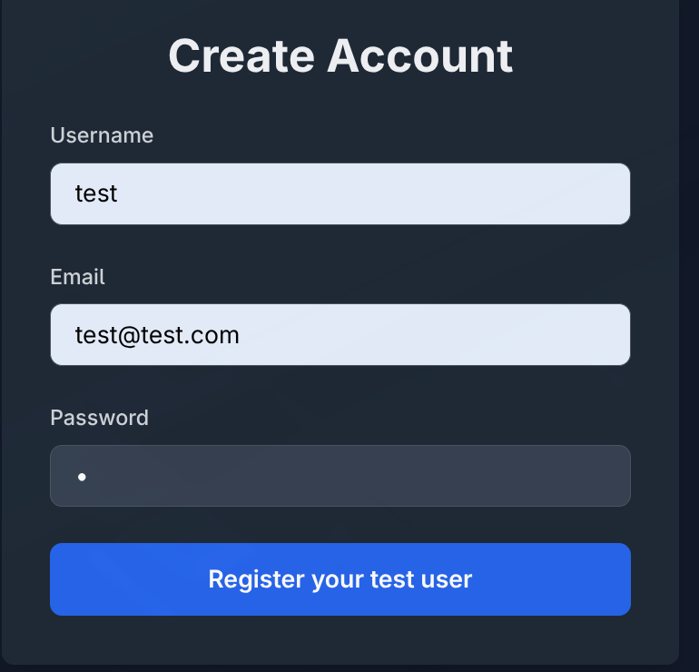

    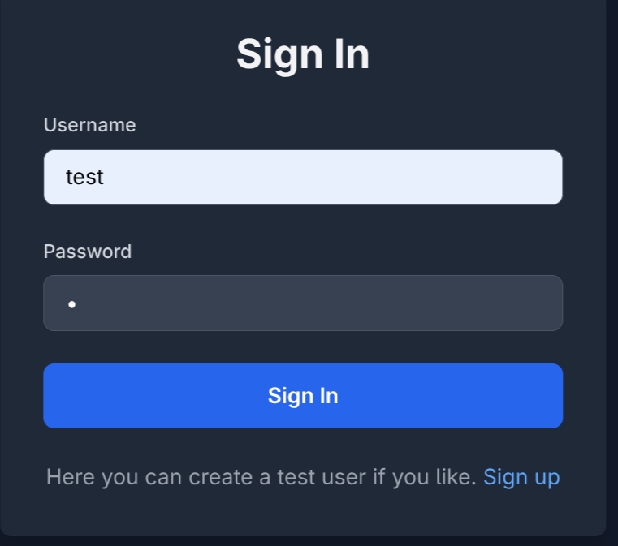

    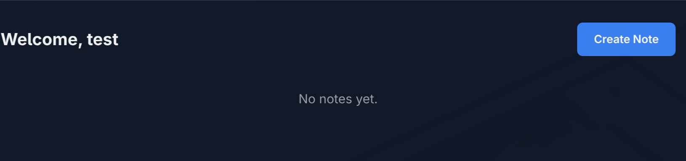

    After:

    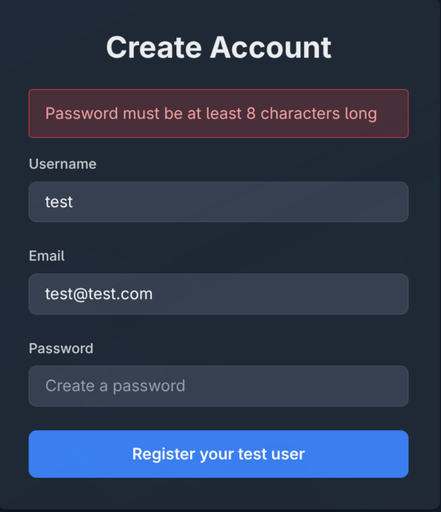

    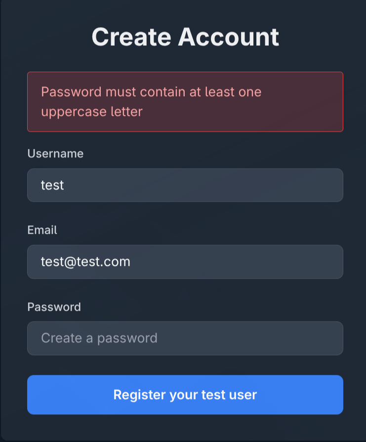

    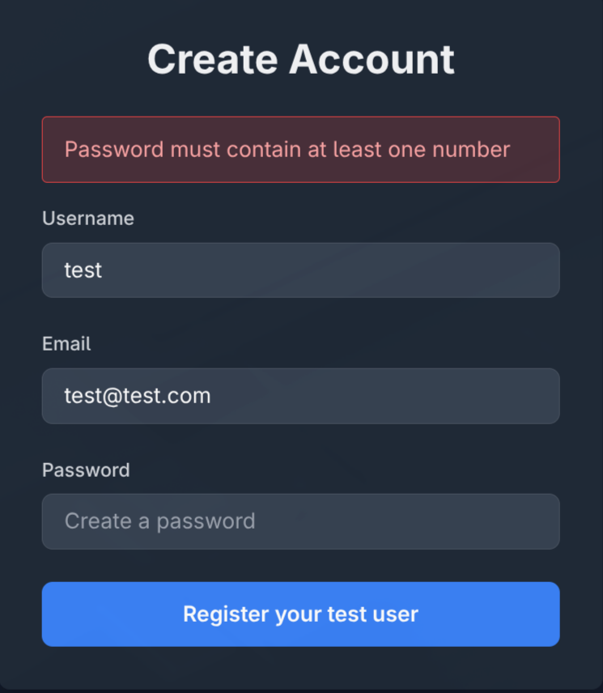    

2. **A04 - Cryptographic Failures** (Plain text passwords)

    **Explointing the fault**
    1. Register any new user with any password
    2. Open a terminal and query the database from the project's root
        ```bash
        sqlite3 vulnerablenotes.db "SELECT username, password FROM users;"
        ```
    3. **Result**: All passwords are visible in plain text
    **Fix:** 
    1. Comment out lines 63-67 in [database.py](app/database.py#L63) and lines 37-40 in [auth.py](app/routers/auth.py#L37)
    2. Uncomment lines 68-74 in [database.py](app/database.py#L68) lines 41-46 in [auth.py](app/routers/auth.py#L41)
    3. Remove the database file with `rm vulnerablenotes.db`
    4. Start the app again
    
    **Screenshots**

    Before:
    
    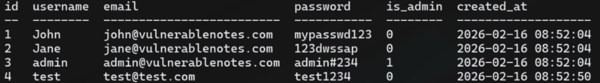

    After:

    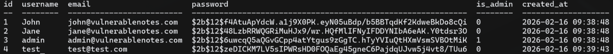

3. **A05 - Injection** (SQL Injection)
 
    **Explointing the fault**
    1. Go to the login page
    2. Write in the username as `admin '--`
    3. In the password field write anything
    4. **Result**: Logged in as an admin

    **Why this works** The `--` part of the username starts an SQL comment and bypasses the password check completely

    **Fix:** 
    1. Comment out lines 58-59 in [auth.py](app/routers/auth.py#L58)
    2. Uncomment lines 61-68 in [auth.py](app/routers/auth.py#L61)
    3. Try the exploit again

    **Screenshots**:
    Before:

    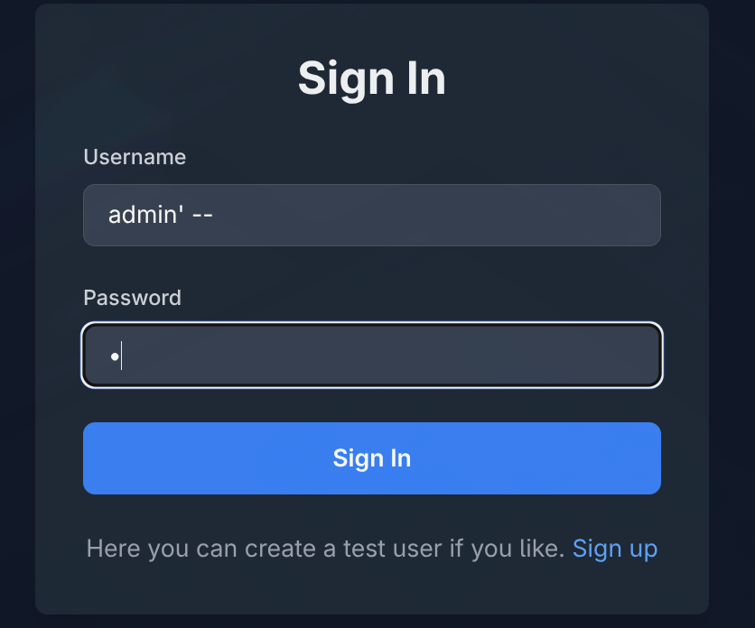    
    
    

    After(this is the result after trying with the same credentials as in the exploit): 

    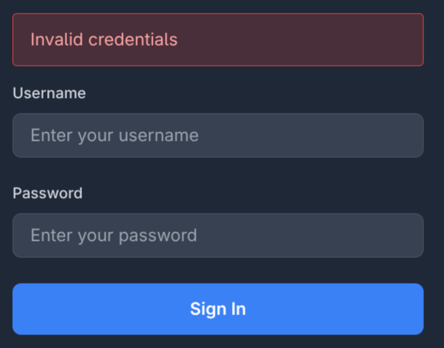    


4. **A08 - Software/Data Integrity Failures** (No File Upload Validation)
 
    **Explointing the fault**
    1. Login as any user you like
    2. On your computer, create a .php or .sh file for example and add any content you like.
    3. Create a new note, give it a title, some content and upload the file you created
    4. **Result:** the file is uploaded and it is downloadable.

    **Fix:**: Uncomment lines 58-65 in [notes.py](app/routers/notes.py#L58)
    1. Try to exploit again. You should get an error message which states that the filetype is not allowed
    2. Then you can try to create a .md file in your computer and upload it to a new note. This should also work because of the validation.

    **Screenshots**

    Before:

    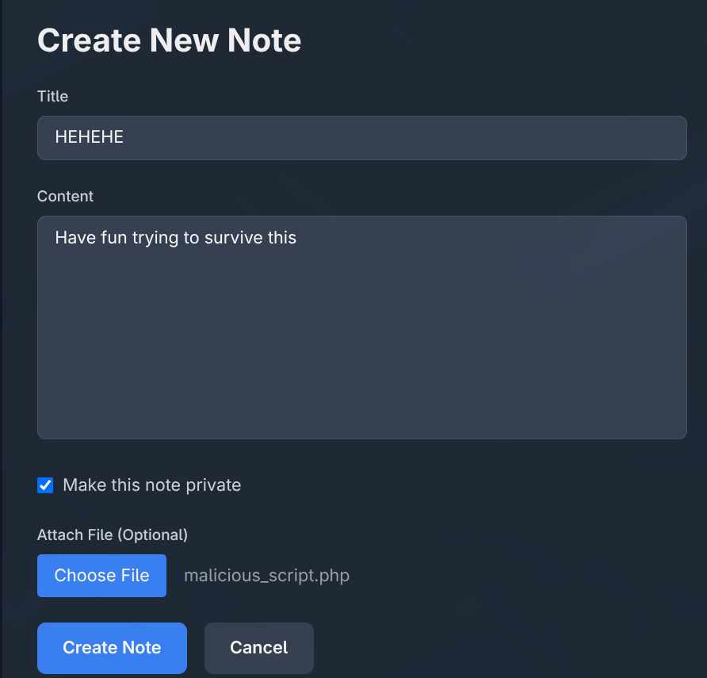
    
    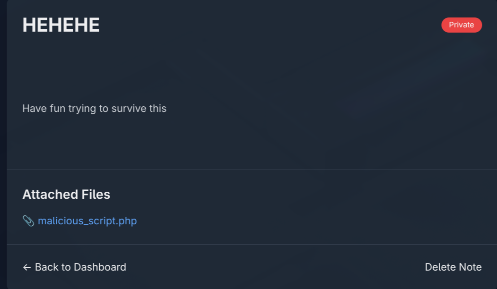

    After:

    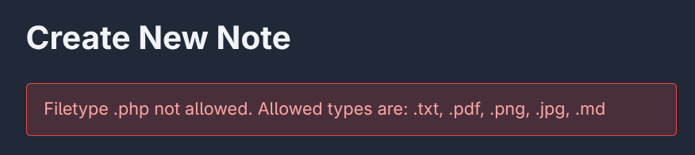

    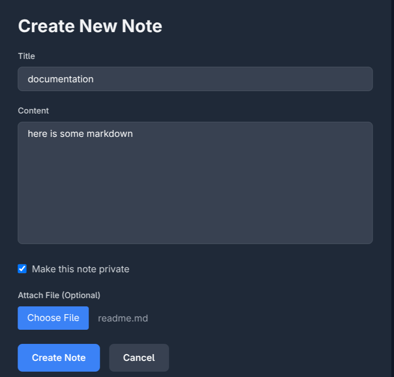
    
    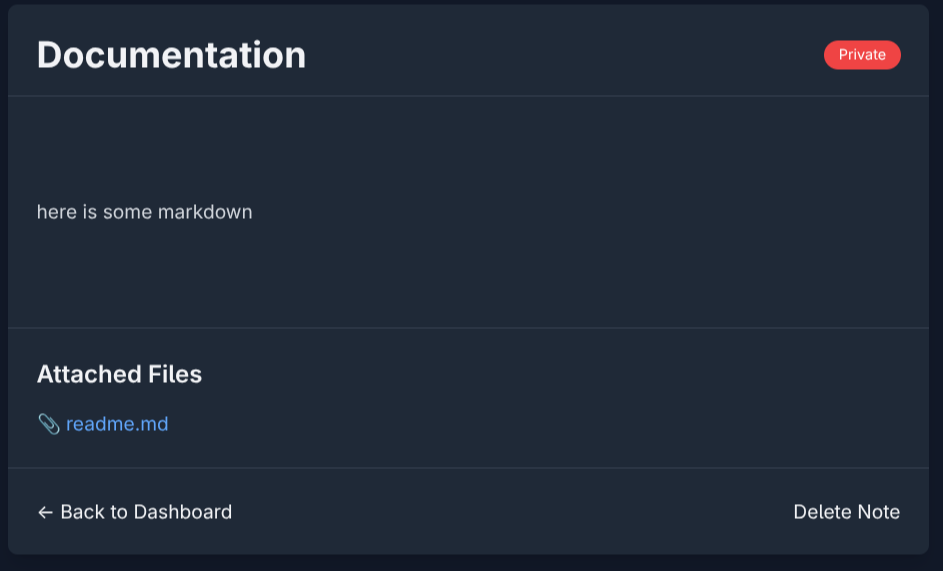


5. **A01 - Broken Access Control** (Unauthorized Note Access)
 
    **Explointing the fault**
    1. Login as John
    2. View your notes, make sure you get the id:s of the notes(the last note of John should be at `note/2` on a fresh database with no additional notes)
    3. With this in mind try to access the route `note/3`.
    4. **Result** Alice's private note can be viewed by John.

    **Fix:**
    1. Comment out lines 95-99 in [notes.py](app/routers/notes.py#L95)
    2. Uncomment lines 100-104 in [notes.py](app/routers/notes.py#100)
    3. Try the exploit again. Your browser should raise an error.
    **Screenshots**

    Before:
    
    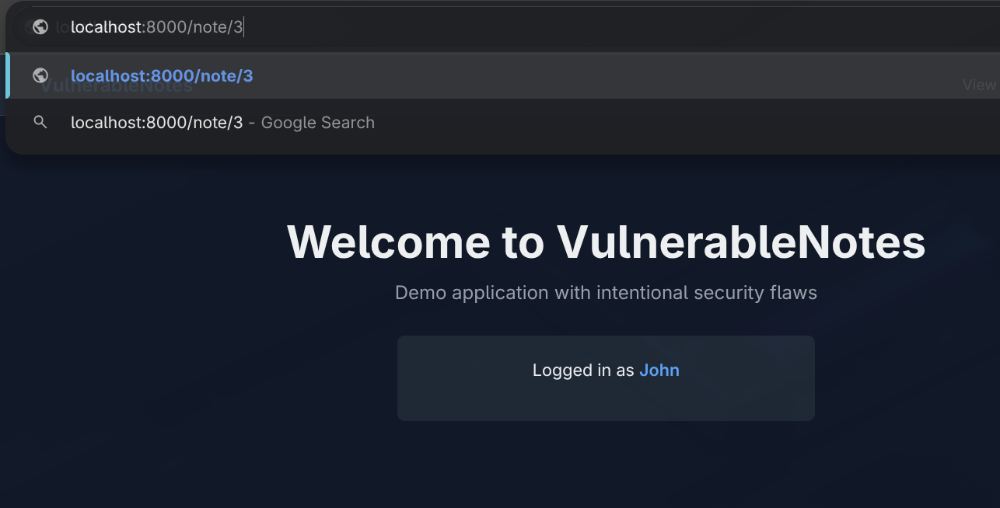

    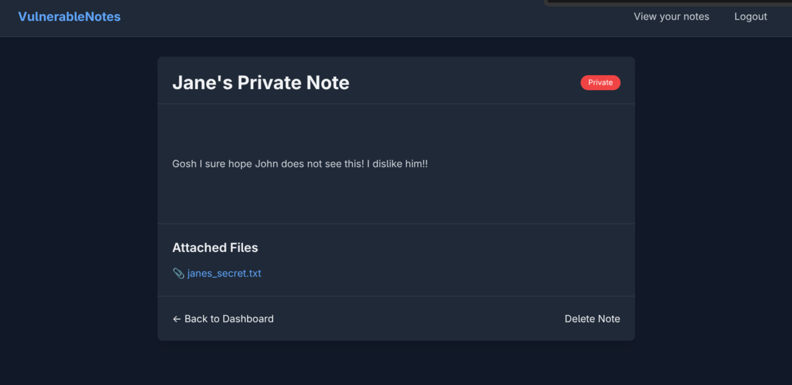

    After:
    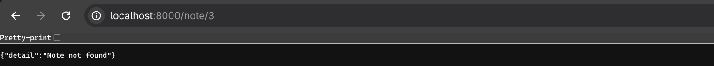

---
